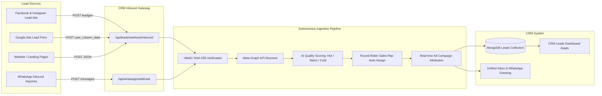

# Digitalness CRM — Live Lead Ingestion Setup Guide

This document provides end-to-end instructions for connecting real-time lead capture from **Meta Ads (Facebook & Instagram)**, **WhatsApp Cloud API**, **Google Ads**, and **Websites / Landing Pages** directly into Digitalness CRM.

---

## Architecture Overview



---

## 1. Meta Ads (Facebook & Instagram Lead Gen Forms)

When prospects submit an **Instant Form** on Facebook or Instagram, Meta sends an encrypted webhook containing a `leadgen_id`. The CRM automatically connects to Meta's Graph API, fetches the decrypted contact details, scores the lead, and assigns it to your sales team.

### Step 1: Expose Backend via HTTPS
Meta requires a publicly accessible HTTPS URL.
- **For Production**: Use your deployed domain, e.g., `https://api.digitalness.agency`.
- **For Local Testing**: Run `ngrok http 5000` to get a temporary HTTPS URL (e.g., `https://abcd-123.ngrok-free.app`).

### Step 2: Configure Webhook in Meta Developer Dashboard
1. Go to **[Meta for Developers](https://developers.facebook.com/apps/)** and select your Business App.
2. In the left sidebar, find **Webhooks** (or add **Webhooks** from "Add Products").
3. Select **Page** from the dropdown.
4. Click **Subscribe to this object** or **Edit Subscription**:
   - **Callback URL**: `https://<YOUR_DOMAIN>/api/leads/webhook/inbound`
   - **Verify Token**: Enter the token matching your `META_WEBHOOK_VERIFY_TOKEN` in `.env`:
     ```
     digitalness_wa_verify_2026
     ```
5. Click **Verify and Save**. (The CRM will automatically respond to Meta's `hub.challenge`).
6. In the Page webhook fields table, locate **`leadgen`** and click **Subscribe**.

### Step 3: Configure Page Access Token
To retrieve the prospect's answers, the CRM needs permission to read leads for that Facebook Page.

**Option A (Recommended — Automated CRM Integration)**:
1. In the CRM Dashboard, go to **Integrations** -> **Connect Meta**.
2. Complete Facebook Login and grant:
   - `leads_retrieval`
   - `pages_show_list`
   - `pages_read_engagement`
   - `pages_manage_ads`
3. The CRM automatically encrypts and stores the Page Access Token in `MarketingConnection`.

**Option B (Manual Environment Variable)**:
1. Generate a permanent Page Access Token from Meta Business Suite / Graph API Explorer.
2. Add it to `Backend/.env`:
   ```env
   META_PAGE_ACCESS_TOKEN=EAAB...
   ```

### Step 4: Test Real-Time Ingestion
1. Visit the **[Meta Lead Ads Testing Tool](https://developers.facebook.com/tools/lead-ads-testing)**.
2. Select your **Page** and **Form**.
3. Click **Create Lead**.
4. Click **Track Status**. You will see:
   ```json
   "status": "success",
   "http_code": 201
   ```
5. Open your CRM dashboard at `http://localhost:8080/leads` to see the lead instantly appear with **Hot/Warm** scoring and an assigned sales representative.

---

## 2. WhatsApp Cloud API (Inbound Messages & Leads)

Digitalness CRM automatically converts new WhatsApp prospect chats into CRM Leads, captures conversational intent, and logs all chats in the Unified Inbox.

### Step 1: Configure WhatsApp Webhook
1. In Meta Developer Dashboard, select your App -> **WhatsApp** -> **Configuration**.
2. Under **Webhook**, click **Edit**:
   - **Callback URL**: `https://<YOUR_DOMAIN>/api/whatsapp/webhook`
   - **Verify Token**: `digitalness_wa_verify_2026`
3. Click **Verify and save**.
4. Under **Webhook fields**, click **Manage** and subscribe to **`messages`**.

### Step 2: Set Environment Variables
In `Backend/.env`, fill in your WhatsApp Cloud API credentials:
```env
WHATSAPP_PHONE_NUMBER_ID=1091544340122580
WHATSAPP_BUSINESS_ACCOUNT_ID=...
WHATSAPP_ACCESS_TOKEN=EAAB...
WHATSAPP_APP_SECRET=3df485f7ee3559de0bd90b6ddaf6a35d
WHATSAPP_WEBHOOK_VERIFY_TOKEN=digitalness_wa_verify_2026
```

---

## 3. Google Ads Lead Form Extensions

Google Ads can stream leads in real-time as users submit lead forms from Google Search, YouTube, or Display ads.

### Step 1: Open Google Ads
1. Sign in to your **Google Ads Account**.
2. In the left page menu, click **Ads & assets** -> **Assets** -> **Lead form**.
3. Create or edit a lead form.
4. Scroll to **Lead delivery option** and select **Manage your leads with a webhook**.

### Step 2: Enter Delivery Details
- **Webhook URL**: `https://<YOUR_DOMAIN>/api/leads/webhook/inbound`
- **Key**: Any secret passphrase or leave blank.

### Step 3: Test Delivery
1. Click **Send test data**.
2. Google sends a test lead payload with `user_column_data` (`FULL_NAME`, `PHONE_NUMBER`, `EMAIL`).
3. The CRM ingests it as a **Google Ads** lead and attributes it to your active Google Ads campaigns.

---

## 4. Website, Landing Page & 3rd-Party Forms

You can connect your custom website (Next.js, WordPress, Webflow, Elementor, Typeform, Zapier, Make) directly via HTTP POST.

### Endpoint
`POST https://<YOUR_DOMAIN>/api/leads/webhook/inbound`

### JSON Payload Schema
```json
{
  "name": "Arjun Sharma",
  "phone": "+919876543210",
  "email": "arjun@example.com",
  "businessType": "Real Estate Developers",
  "requirement": "Full Funnel Lead Generation & Meta Ads",
  "budget": 45000,
  "timeline": "Urgent",
  "source": "Website Form",
  "utm_source": "meta_ads",
  "utm_campaign": "q3_growth_accelerator"
}
```

### JavaScript / HTML Contact Form Example
```javascript
async function submitContactLead(formData) {
  try {
    const response = await fetch("https://<YOUR_DOMAIN>/api/leads/webhook/inbound", {
      method: "POST",
      headers: {
        "Content-Type": "application/json"
      },
      body: JSON.stringify({
        name: formData.name,
        phone: formData.phone,
        email: formData.email,
        businessType: formData.businessType || "Inbound",
        requirement: formData.serviceNeeded,
        budget: Number(formData.budget) || 25000,
        source: "Website Contact Form"
      })
    });

    const result = await response.json();
    if (result.success) {
      alert("Thank you! A senior consultant will reach out shortly.");
    }
  } catch (error) {
    console.error("Lead submission error:", error);
  }
}
```

---

## 5. Webhook Ingestion Pipeline Details

Whenever a lead enters `/api/leads/webhook/inbound`:

1. **Security Handshake**:
   - Meta `GET` requests with `hub.challenge` are verified with `digitalness_wa_verify_2026`.
   - Meta `POST` requests are validated using cryptographic HMAC-SHA256 (`x-hub-signature-256`).
2. **Data Normalization**:
   - Standardizes variations like `fullName`, `contactNumber`, `mobile`, `user_column_data`, and Meta `field_data`.
3. **Autonomous Lead Scoring**:
   - Commercial keywords ("urgent", "growth", "ads", "website") or budgets $\ge ₹30,000$ are flagged as **Hot**.
   - Standard quotes or budgets $\ge ₹15,000$ are scored as **Warm**.
   - Early stage queries are scored as **Cold**.
4. **Smart Sales Rep Routing**:
   - Queries active sales executives and assigns the lead to the representative with the lowest active workload (balanced round-robin).
5. **Campaign Attribution**:
   - Correlates incoming campaign IDs or UTM tags back to active `AdCampaign` records to calculate live **Cost Per Lead (CPL)** and **ROAS**.

---

## 6. Troubleshooting & Diagnostics

| Symptom | Cause | Solution |
| :--- | :--- | :--- |
| **Meta shows `403 Verification Failed`** | Token mismatch | Ensure `META_WEBHOOK_VERIFY_TOKEN` in `Backend/.env` matches the token entered in Meta Dashboard (`digitalness_wa_verify_2026`). |
| **Meta shows `401 Invalid Signature`** | App Secret mismatch | Verify `META_APP_SECRET` in `.env` matches the App Secret from App Settings -> Basic in Meta Dashboard. |
| **Lead name shows "Meta Test Lead"** | No Page Access Token | Connect your Facebook Page via CRM OAuth or provide `META_PAGE_ACCESS_TOKEN` in `.env`. |
| **Local testing fails** | Localhost is not reachable by Meta | Start ngrok (`ngrok http 5000`) and use the `https://...ngrok-free.app` URL for the callback. |
